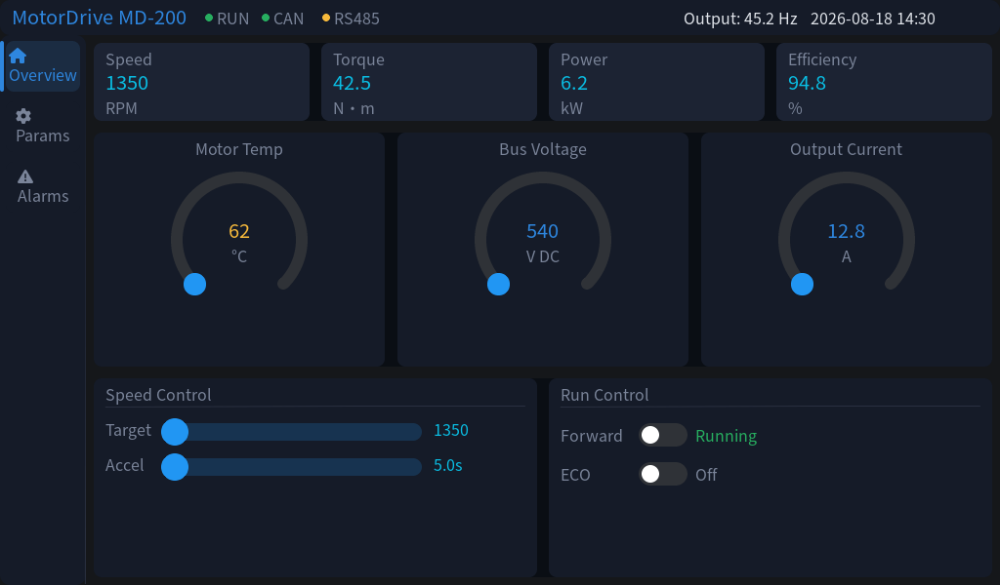
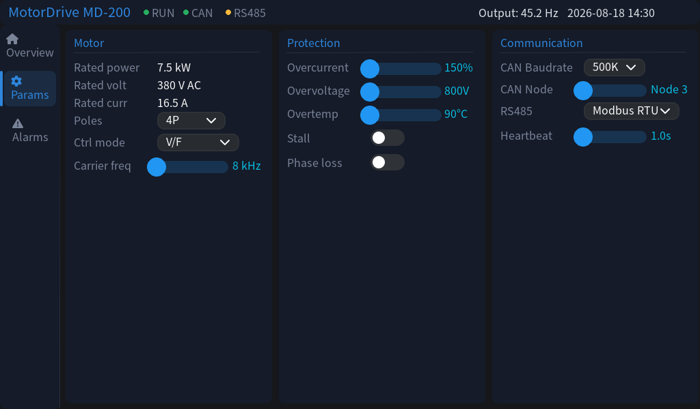
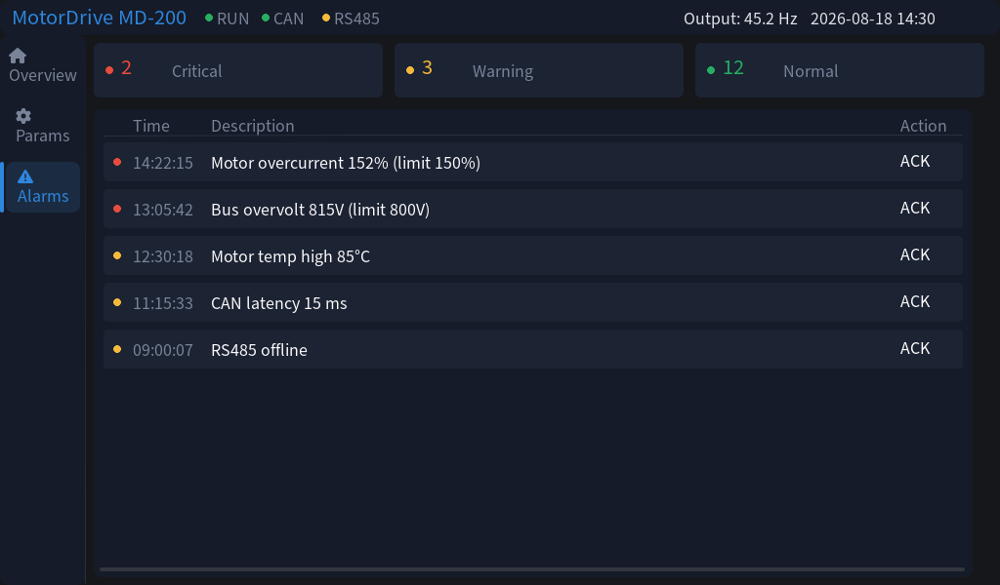
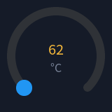

# eez-studio-mcp

**Turn EEZ Studio into an AI-drivable LVGL UI editor.**

An MCP (Model Context Protocol) server + AI skill + IR compiler that lets Claude, Cursor, ZCode, DSH or any MCP client read and edit LVGL projects *inside* EEZ Studio — widget by widget, style by style — with screenshots, live checking, a wasm simulator, and even input injection.

[中文文档 (Chinese)](README.zh-CN.md) · [Patched EEZ Studio](https://github.com/IWILLTBEST/studio) (required runtime)


## Screenshots

All three screens below were generated from the IR compiler (`examples/motor-en`, the English variant) and captured through the MCP `screenshot` tool — no manual touch. A Chinese-language variant lives in `examples/motor`:

| Overview | Params | Alarms |
|:---:|:---:|:---:|
|  |  |  |

And a **glassmorphism + entrance-animation showcase** ([examples/glass](examples/glass) — translucent cards, shadows, gradient background, staggered entrance via the IR `anim` verb; press **Replay** in the simulator):

<p></p>

And a **per-widget close-up** (`screenshot_object` returns just one widget — handy for AI self-verification):

<p></p>

## What can the AI do?

| Domain | Tools | Highlights |
|---|---|---|
| **Widget editing** | `list_objects` `get_object` `update_object` `create_widget` `delete_object` `create_screen` `undo` `redo` | Address widgets by path **or stable objID**; every edit is an undoable command and auto-saves |
| **Styles & themes** | `list_styles` `update_style` `create_style` `delete_style` `set_theme_color` `add_color` `set_preview_theme` | Edit `definition[part][state]` props; switch theme preview and re-screenshot |
| **Visual loop** | `screenshot` `screenshot_object` `goto_object` `get_selection` | Page PNG, single-widget close-up, locate an object, read what the *user* selected |
| **Diagnostics** | `read_output` `check` `build_project` | Read Checks/Output panels; run full check or C-source build |
| **Runtime & input** | `debug_start/stop/control/status` `read_variable` `write_variable` `send_input` | Drive the LVGL wasm simulator: pause/step, read/write variables, **inject clicks & swipes** (page navigation verified end-to-end) |
| **Project files** | `read_project_json` `write_project_json` `patch_project_json` | RFC 7396 merge-patch and RFC 6902 JSON-Patch for surgical bulk edits |
| **Multi-project** | `list_projects` `select_project` `open_project` | Tab-level project switching, dead-tab recovery |
| **Assets** | `list_assets` `add_font` `add_image` | TTF→LVGL font via the built-in lv_font_conv pipeline (ranges + CJK symbols), images with auto-copy |
| **IR pipeline** | `read_ir` `write_ir` `compile` `reload` `navigate` `ping` | The original generate-from-IR loop |

Protocol extras: **live resources** (`eez://checks`, `eez://debug`, `eez://state`) with change push (~0.4 s), and **progress notifications** for long operations (`check`, `build_project`, `debug_start`, `add_font`, …).

## The IR compiler & firmware contract

`ir2eez.py` compiles a declarative JSON IR into a `.eez-project`, and — when the IR declares native actions — generates an **`action.h`** firmware contract:

```c
// action.h — auto-generated
void on_speed(int32_t value);   // slider/arc: current value
void on_fwd(int32_t value);     // switch: 0/1
void on_poles(int32_t value);   // dropdown: option index
void ack_alarm(void);           // click: no args
```

The UI binds global variables *down* (firmware changes a variable → every bound widget refreshes each tick) and fires native actions *up* (user drags a slider → your C callback runs). Implement the callbacks, include the header, and the port is done. Tool output is yours — not GPL-covered (same as GCC output).

```bash
git clone https://github.com/IWILLTBEST/eez-studio-mcp && cd eez-studio-mcp
pip install mcp httpx
python ir2eez.py examples/motor-en/motor-en.ir.json -o motor-demo.eez-project
# → motor-demo.eez-project + action.h (12 native actions); 中文版: examples/motor/motor.ir.json
```

## Setup

> **Status 2026-08**: the full extension interface landed upstream ([eez-open/studio#1043](https://github.com/eez-open/studio/pull/1043) + [#1044](https://github.com/eez-open/studio/pull/1044) + [#1047](https://github.com/eez-open/studio/pull/1047)) — an installed extension now receives everything it needs: `api.renderer` (`getOpenProjects`, `getActiveProjectStore`, `activateProjectTab`, `openProject`, `requireModule`) plus three capability toolkits (object model / LVGL / assets). The [`extension/`](extension/) runs the **full 45-tool set end-to-end** on that API alone.

**Preferred once your Studio build includes those PRs** — install the packaged extension ([release `extension-v0.2.0`](https://github.com/IWILLTBEST/eez-studio-mcp/releases/tag/extension-v0.2.0), `.eez-extension` file) via the extensions manager, and skip the fork entirely:

1. **EEZ Studio** — build [eez-open/studio](https://github.com/eez-open/studio) master (or any release after these PRs), install the `.eez-extension` from the release above, open a project. The extension's bridge listens on `127.0.0.1:17620`.

   Until a Studio release ships the API, the patched fork below is the easiest runtime — it has the bridge built in, no extension needed:

   ```bash
   git clone https://github.com/IWILLTBEST/studio
   cd studio && npm install && npm start
   ```

   The bridge listens on `127.0.0.1:17620` either way. Open or create a project.

2. **Register the MCP server** with your client (see `claude_desktop_config.example.json`). The MCP layer ships as **two interchangeable implementations** — same 45 tools, resources, prompts and progress notifications on both:

   - **Node.js (recommended)** — `mcp-server.mjs`, **zero npm dependencies**: JSON-RPC over stdio is implemented by hand (newline-delimited JSON). Needs only Node.js 18+:

     ```json
     {
       "mcpServers": {
         "eez-studio": { "command": "node", "args": ["<repo>/mcp-server.mjs"] }
       }
     }
     ```

   - **Python** — `eez_mcp_server.py`, built on the official `mcp` SDK (Python 3.10+, `pip install mcp httpx`):

     ```json
     {
       "mcpServers": {
         "eez-studio": { "command": "python", "args": ["<repo>/eez_mcp_server.py"] }
       }
     }
     ```

3. **Talk to it** — e.g. *“list the screens”*, *“change the navbar indicator to green and show me a screenshot”*, *“drag the speed slider and tell me which page the simulator is on”*.

4. **(Optional) install the skill** — copy `SKILL.md` into your agent's skills directory. It encodes the accumulated engineering rules: manual-centering formulas, the `text_align` vs `align` pitfall, the font pipeline, the native-action contract, plus the full motor case study.

## The motor example

| Layer | Contents |
|---|---|
| Data down | 13 global variables → metric cards, gauges, LEDs, switches, clock |
| Navigation | 3 flow actions (`nav_overview/params/alarms` → changeScreen) |
| Input up | 12 native actions wired at 24 points (sliders, arcs, switches, dropdowns, ack buttons) |

Layout: manual coordinates everywhere (`x = center - w/2`), value labels in fixed-width boxes with centered text, every card wrapped in a panel. The mockup (`examples/motor/motor_ui.html`), the IR, and the generated project stay pixel-faithful — verified down to ±2 px.

Two language variants of the same UI: `examples/motor` (Chinese) and `examples/motor-en` (English). English text runs ~25% wider than CJK at the same font size, so the English variant widens the navbar (64 → 88 px) and re-plans every label column — a realistic demo of what localization means under a manual-coordinate layout.

## Notes & gotchas

- The bridge is localhost-only by design.
- Corporate proxies/VPNs: both servers keep their loopback calls off the system proxy (Python pins `trust_env=False`; the Node server scrubs `HTTP_PROXY`-style env vars at startup) — a system proxy can otherwise add ~1.7 s per call and stall progress notifications.
- Requires the patched Studio plus either Node.js 18+ (for `mcp-server.mjs`, recommended) or Python 3.10+ with `mcp`/`httpx` (for `eez_mcp_server.py`). The two MCP implementations are behaviorally aligned (45 tools, RFC 6902/7396 patching, live resources, progress heartbeats) and tested on Windows.
- Fonts in `fonts/` are Source Han Sans (OFL) subsets + FontAwesome (OFL/CC-BY 4.0) — regenerable via `font_tool.py`.

## License

**GPL-3.0** — in the spirit of the EEZ Studio ecosystem this builds on. Generated artifacts (`.eez-project`, `action.h`) are your own work and not covered by the GPL. Fonts keep their upstream licenses (OFL / CC-BY 4.0).

## Acknowledgments

- [eez-open/studio](https://github.com/eez-open/studio) — EEZ Studio, the foundation everything here drives
- [LVGL](https://lvgl.io/) and [lv_font_conv](https://github.com/lvgl/lv_font_conv)
- [Source Han Sans](https://github.com/adobe-fonts/source-han-sans) & [FontAwesome](https://fontawesome.com)
