# eez-studio-mcp

[](https://github.com/IWILLTBEST/eez-studio-mcp/actions/workflows/pr-check.yml)

**把 EEZ Studio 变成 AI 可操控的 LVGL 界面编辑器。**

MCP（Model Context Protocol）服务器 + AI 技能 + IR 编译器：让 Claude、Cursor、ZCode、DSH 或任何 MCP 客户端直接读写 EEZ Studio 里的 LVGL 工程——逐部件、逐样式，带截图自查、实时检查、wasm 模拟器、点击注入，还有**视觉回归金标准和无头 CI**——每次推送都逐像素重新验证。

[English](README.md) · [带桥的 EEZ Studio](https://github.com/IWILLTBEST/studio)（必需运行时）

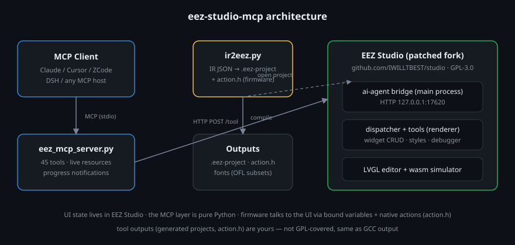

## 截图

下面三屏全部由 IR 编译器生成（`examples/motor`），再通过 MCP 的 `screenshot` 工具抓取——零手工修饰：

| 总览 | 参数 | 告警 |
|:---:|:---:|:---:|
| 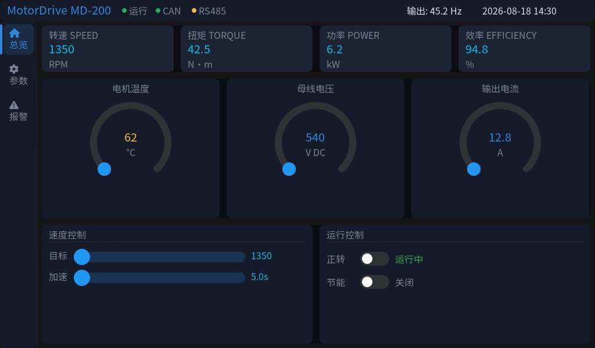 | 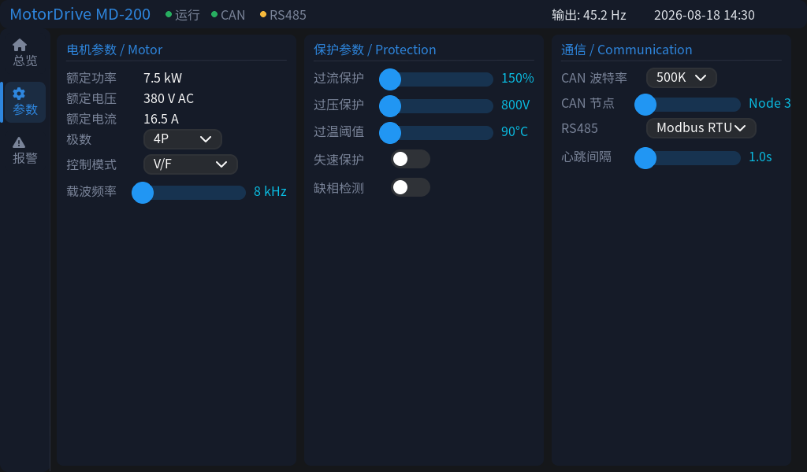 | 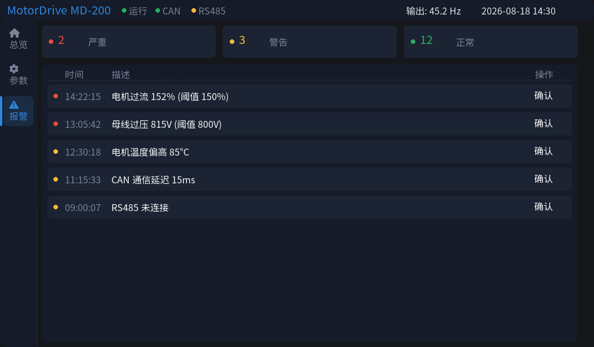 |

**玻璃拟态 + 入场动画 showcase**（[examples/glass](examples/glass)——半透明卡片、阴影、渐变底，入场动画由 IR `anim` 动词错峰编排；模拟器里按 **Replay** 重放）：

<p>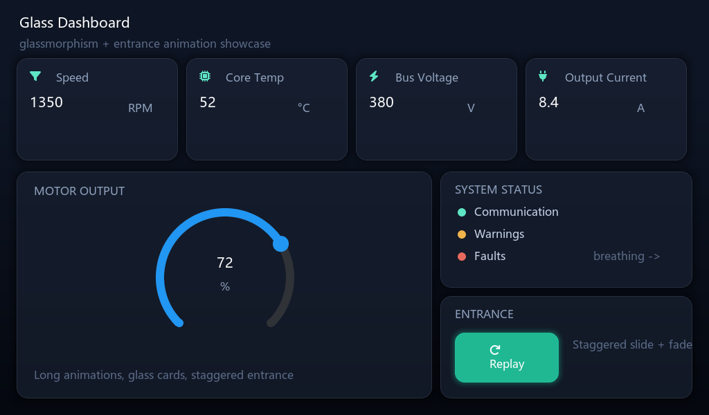</p>

**i18n，一份 IR 两种语言**（[examples/i18n](examples/i18n)——label 编译成 `T"key"` 表达式，固件上经 lv_i18n 解析；画布经 previewValue 预览默认语言，改 `strings.default` 重编译即切换）：

| 英文（`"default": "en"`） | 中文（`"default": "zh"`） |
|:---:|:---:|
| 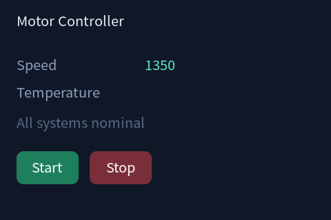 | 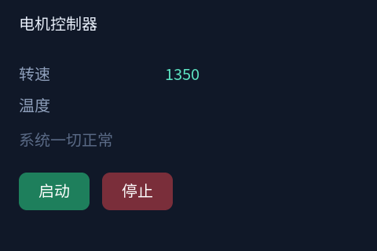 |

**富数据部件演示**（[examples/richdata](examples/richdata)——双向绑定选中项的滚轮、三色分段刻度盘、日历、spinbox、键盘+输入框、可编辑页签的 tabview；chart/table 按 EEZ 设计编译为裸 LVGL 对象，由生成的 `ui_ext.c` 完成运行时装配）：

| main（滚轮·图表·表格） | controls（刻度盘·日历·spinbox·键盘） | settings（tabview） |
|:---:|:---:|:---:|
| 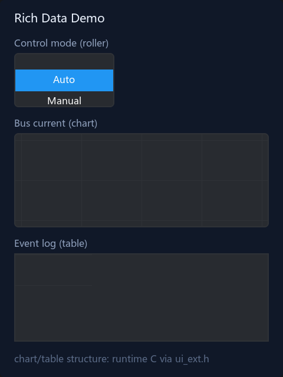 | 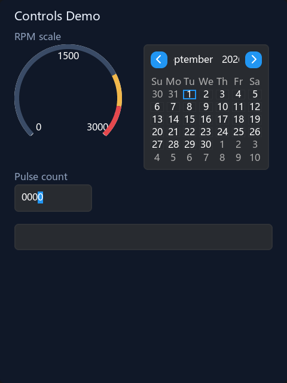 | 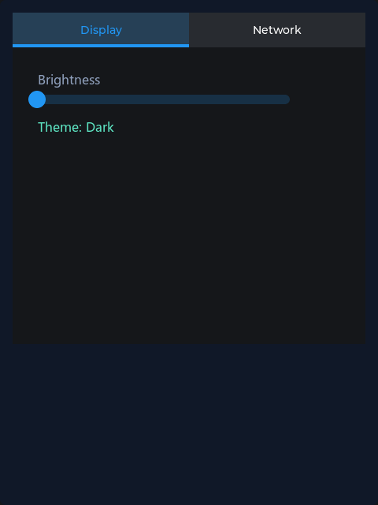 |

**单部件特写**（`screenshot_object` 只返回一个部件——AI 自查利器）：

<p>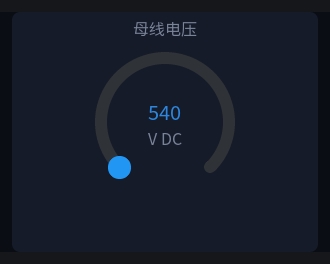</p>

## AI 能做什么？

| 能力域 | 工具 | 亮点 |
|---|---|---|
| **部件级编辑** | `list_objects` `get_object` `update_object` `create_widget` `delete_object` `create_screen` `undo` `redo` | 按路径**或稳定 objID** 寻址；每次编辑都是可撤销的命令，自动保存 |
| **样式与主题** | `list_styles` `update_style` `create_style` `delete_style` `set_theme_color` `add_color` `set_preview_theme` | 直接改 `definition[part][state]` 属性；切主题预览再截图验证配色 |
| **视觉闭环** | `screenshot` `screenshot_object` `goto_object` `get_selection` | 整页截图、单部件特写、定位对象、读**用户当前选中**（人在回路） |
| **视觉回归** | `visual_baseline` `visual_check` | 每屏锁定金标准截图；带抗锯齿容差的像素比对——失败返回 `changedPixels`/`changedPct`/`bbox` 定位框和红色标注 diff 图 |
| **诊断** | `read_output` `check` `build_project` | 读 Checks/Output 面板；跑完整检查或真实构建（生成 C 源码） |
| **运行时与输入** | `debug_start/stop/control/status` `read_variable` `write_variable` `send_input` | 操控 LVGL wasm 模拟器：暂停/单步、读写变量、**注入点击与滑动**（实测点击导航按钮完成切页） |
| **工程文件** | `read_project_json` `write_project_json` `patch_project_json` | RFC 7396 深合并 + RFC 6902 JSON-Patch，安全的批量结构修改 |
| **多工程** | `list_projects` `select_project` `open_project` | tab 级工程切换，含死 tab 复活 |
| **资产** | `list_assets` `add_font` `add_image` | TTF→LVGL 字体（内建 lv_font_conv 管线，支持区间+中文字符）；图片导入自动落位 |
| **IR 流水线** | `read_ir` `write_ir` `compile` `reload` `navigate` `ping` | 最初的"IR 生成界面"闭环 |

协议层增强：**活资源**（`eez://checks`、`eez://debug`、`eez://state`）内容变化约 0.4 秒推送；长操作（`check`、`build_project`、`debug_start`、`add_font`…）支持**进度通知**。

## IR 编译器与固件接口

`ir2eez.py` 把声明式源文件编译成 `.eez-project`——源格式是 **UIXML**（我们自己的 XML 词汇表：属性即字段、`xmlns:lv` 样式透传、原生注释；刻意不是 LVGL XML 规范——其许可证禁止第三方生成器）。旧 `.ir.json` 仍可编译——现在支持 **23 种部件类型**，从基础件（label/button/slider/arc…）到富数据全家桶（roller、table、chart、scale、calendar、keyboard、spinbox、tabview）。工程旁边会产出三份配套文件：

```text
motor-demo.eez-project     # 用 EEZ Studio 直接打开的原生格式
action.h                   # 固件移植接口：native 动作回调清单
bus.ui_ext.h / .ui_ext.c   # chart/table 运行时装配（序列/量程/表头）
translations.yaml          # lv_i18n 源格式译文表（key × 语言）
```

native 动作约定（`action.h`）：

```c
// action.h — 自动生成
void on_speed(int32_t value);   // 滑条/弧：当前值
void on_fwd(int32_t value);     // 开关：0/1
void on_poles(int32_t value);   // 下拉：选项索引
void ack_alarm(void);           // 点击类：无参
```

交互是双向的：**变量下行**——固件改变量，所有绑定部件每 tick 自动刷新；**动作上行**——用户拖滑条，你的 C 回调被调用。实现这些回调、include 头文件，移植就完成了。工具的**产物归你**，不受 GPL 约束（同 GCC 编译输出）。

**固件构建**：工程内嵌官方 14 文件构建模板，构建会产出 `screens.c`（`create_screens()` 含每个部件的创建调用和 `objects.<id>` 命名句柄）、`flow_def.c`（assets + native 变量表）、`actions.h`、样式/字体/图片。chart/table（EEZ 设计上就是裸对象）由生成的 `ui_ext_init()` 装配——固件接线只有三行：

```c
ui_init();          // studio 生成：引擎 + 资产 + 句柄
ui_ext_init();      // ir2eez 生成：图表序列/量程、表格结构
while (1) { lv_timer_handler(); ui_tick(); /* 喂数据：set_var_speed(...)、chart_bus_push(0, v) */ }
```

**i18n**：label 的 `"tr": "key"` 编译成 `T"key"` 表达式（目标机上经 EEZ Flow 翻译钩子 → lv_i18n 解析，[上游 #1045](https://github.com/eez-open/studio/pull/1045)）；画布经 previewValue 预览默认语言。**动画**：IR `anim` 动词驱动全部七种 EEZ 动画动作，支持 `repeat` 与 `playback`（乒乓）——[上游 #1049](https://github.com/eez-open/studio/pull/1049)。

```bash
git clone https://github.com/IWILLTBEST/eez-studio-mcp && cd eez-studio-mcp
pip install mcp httpx
python ir2eez.py examples/motor/motor.uixml -o motor-demo.eez-project
# → motor-demo.eez-project + action.h（12 个 native 动作）
```

## 视觉回归与无头 CI

交付纪律：**IR 改动 → 编译 → check 0/0 → 金标准命中**。`tools/visreg.py` 驱动桥（打开 → 重载 → 导航 → 截图，等待画布绘制稳定），金标准存在 `golden/`，像素比对带两级容差（单通道差抗锯齿 + 改动像素百分比）——失败返回差异包围盒和红色标注 diff 图。

[`.github/workflows/pr-check.yml`](.github/workflows/pr-check.yml) 在**每次推送/PR 无头**跑完全部：Ubuntu 构建 Studio fork → Xvfb 下运行 → 等桥健康 → `tools/ci-check.py` 对每个示例重新生成、编译、check、金标准比对（18 步）。由此还发现一个好性质：EEZ 画布只用工程内嵌位图字体渲染，**Linux CI 截图与 Windows 金标准逐位一致**（0.0% 漂移）——金标准是跨平台可移植的真值。失败时 diff 图自动作为 artifact 上传。

## 安装

> **状态 2026-09**：完整扩展接口已并入上游（[eez-open/studio#1043](https://github.com/eez-open/studio/pull/1043) + [#1044](https://github.com/eez-open/studio/pull/1044) + [#1047](https://github.com/eez-open/studio/pull/1047)）——安装的扩展能拿到所需的一切：`api.renderer`（`getOpenProjects`、`getActiveProjectStore`、`activateProjectTab`、`openProject`、`requireModule`）加三个能力工具箱（对象模型 / LVGL / 资产）。[`extension/`](extension/) 只靠这套 API 就能端到端跑**全部 47 个工具**。动画 `repeat`/`playback`（[#1049](https://github.com/eez-open/studio/pull/1049)）评审中；我们也向上游询问了 chart/table/list/menu/tileview 的原生编辑计划（[#1050](https://github.com/eez-open/studio/issues/1050)）。

1. **带桥的 EEZ Studio**——若你的 Studio 构建已包含上述 PR：从 [release `extension-v0.2.0`](https://github.com/IWILLTBEST/eez-studio-mcp/releases/tag/extension-v0.2.0) 安装 `.eez-extension` 即可，完全不用 fork。在 PR 进 release 之前，改造版 fork 是最省事的运行时（桥内建，无需扩展）：

   ```bash
   git clone https://github.com/IWILLTBEST/studio
   cd studio && npm install && npm start
   ```

   两种方式桥都监听 `127.0.0.1:17620`，在 Studio 里打开（或新建）一个工程。

2. **把 MCP 服务器注册进你的客户端**（示例见 `claude_desktop_config.example.json`）。MCP 层是**双实现、可互换**——47 个工具、资源、提示词、进度通知两边完全一致：

   - **Node.js（推荐）**——`mcp-server.mjs`，**零 npm 依赖**：stdio 上的 JSON-RPC 纯手写（换行分隔 JSON），只要 Node.js 18+：

     ```json
     {
       "mcpServers": {
         "eez-studio": { "command": "node", "args": ["<仓库路径>/mcp-server.mjs"] }
       }
     }
     ```

   - **Python**——`eez_mcp_server.py`，基于官方 `mcp` SDK（Python 3.10+，`pip install mcp httpx`）：

     ```json
     {
       "mcpServers": {
         "eez-studio": { "command": "python", "args": ["<仓库路径>/eez_mcp_server.py"] }
       }
     }
     ```

3. **开始对话**——比如"列出所有屏幕"、"把导航栏指示灯改成绿色并截图给我看"、"拖一下速度滑条，告诉我模拟器现在在哪个页面"。

4. **（可选）安装技能**——把 `SKILL.md` 拷进你 agent 的技能目录。里面沉淀了全部工程经验：手动坐标居中公式、`text_align` 与 `align` 的大坑、字体流水线、native 动作约定，以及 motor 完整案例范式。

## 示例总览

| 示例 | 展示 |
|---|---|
| `examples/motor` / `motor-en` | 三屏电机控制器：13 个绑定变量、12 个 native 动作、中英文布局变体 |
| `examples/glass` | 玻璃拟态 + 错峰入场动画（`anim` 动词、`lv` 样式透传） |
| `examples/i18n` | `T"key"` 标签，一份 IR 出英/中两语，`translations.yaml` |
| `examples/richdata` | roller/table/chart/scale/calendar/keyboard/spinbox/tabview + `ui_ext.c` |

### motor 示例

| 层 | 内容 |
|---|---|
| 数据下行 | 13 个全局变量 → 指标卡、仪表、LED、开关、时钟 |
| 页面导航 | 3 个 flow action（`nav_overview/params/alarms` → changeScreen） |
| 输入上行 | 12 个 native 动作、24 处接线（滑条/弧/开关/下拉/告警确认按钮） |

布局全手动坐标（`x = 参考中心 - w/2`），数值 label 固定宽盒子 + 文字居中，每个卡片 panel 包裹。效果图（`examples/motor/motor_ui.html`）、IR、生成工程三者像素级一致——实测误差 ±2px。

同一套界面有两个语言版本：`examples/motor`（中文）和 `examples/motor-en`（英文，见主 README 截图）。英文在同等字号下比中文宽约 25%，因此英文版把导航栏从 64px 加宽到 88px 并重排了所有标签列——这也是手动坐标布局下做本地化的真实代价展示。

## 注意事项

- 桥只监听本机回环，刻意如此。
- 公司代理/VPN：两个实现都不让回环请求走系统代理（Python 固定 `trust_env=False`；Node 版启动时清掉 `HTTP_PROXY` 类环境变量）——否则系统代理会让每次调用慢 ~1.7 秒，还会饿死进度通知。
- 需要带桥的 Studio，外加 Node.js 18+（跑 `mcp-server.mjs`，推荐）或 Python 3.10+ 配 `mcp`/`httpx`（跑 `eez_mcp_server.py`）。两个 MCP 实现行为对齐（47 个工具、RFC 6902/7396 补丁、活资源、进度心跳），Windows 实测。
- `fonts/` 里是可再分发的字体子集（来源见 `fonts/*.meta.json`），可用 `font_tool.py` 重新生成。示例用的 `demo_*` 字体是免费替代品以保证本仓可再分发；金标准即按它们捕获。

## 许可

**GPL-3.0**——与它所依托的 EEZ Studio 生态保持一致。生成的产物（`.eez-project`、`action.h`）是你自己的作品，不受 GPL 约束；字体保留各自上游许可（OFL / CC-BY 4.0）。

## 致谢

- [eez-open/studio](https://github.com/eez-open/studio) —— EEZ Studio，一切的基座
- [LVGL](https://lvgl.io/) 与 [lv_font_conv](https://github.com/lvgl/lv_font_conv)
- [思源黑体](https://github.com/adobe-fonts/source-han-sans) 与 [FontAwesome](https://fontawesome.com)
