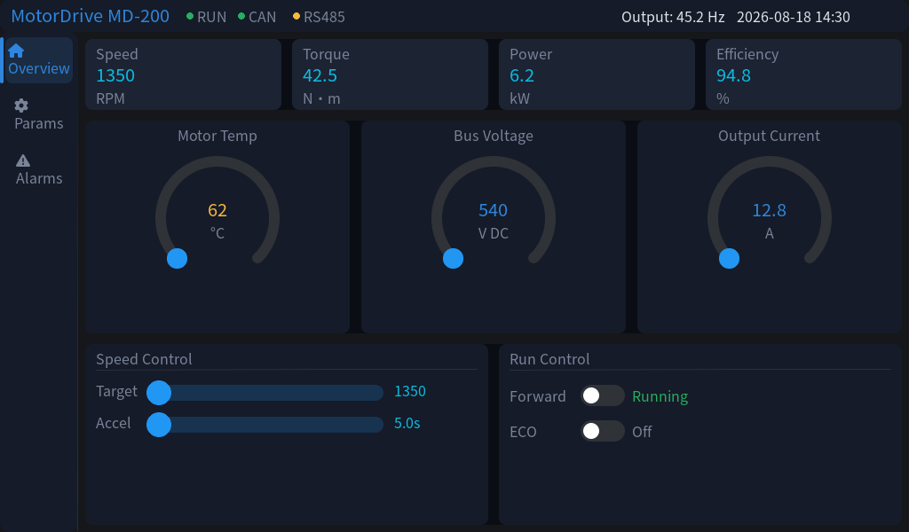
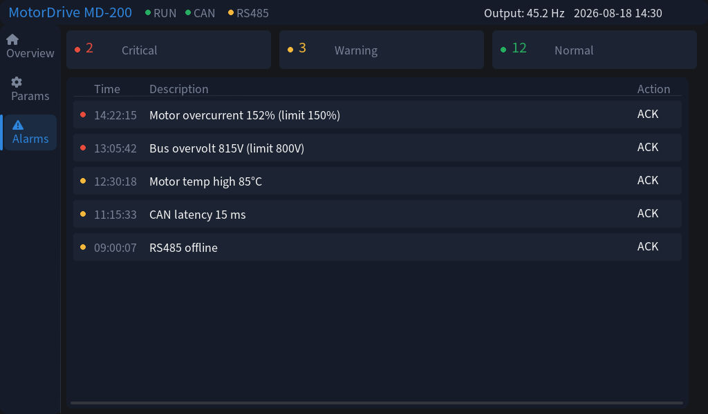
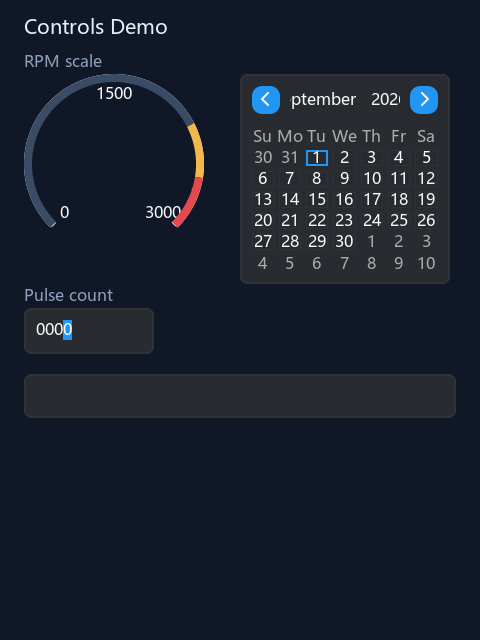

# eez-studio-mcp

一个 MCP（Model Context Protocol）服务器：让 Claude、Cursor、ZCode、DSH 或任何 MCP 客户端**直接在 EEZ Studio 内部**读写 LVGL 工程——逐部件、逐样式——支持截图、实时检查、wasm 模拟器、输入注入与视觉回归。

```
MCP 客户端 (Claude / Cursor / ZCode / ...)
        |  stdio / SSE
        v
eez_mcp_server.py / mcp-server.mjs      (本仓)
        |  HTTP (桥 127.0.0.1:17620)
        v
EEZ Studio  <->  studio-extension/ (Studio 侧桥扩展)
```

> **2026-09 仓库分离**：XML/UIXML 工具链、IR 编译器（`ir2eez`）、VS Code 扩展、
> wasm 模拟器外壳、示例、金标准与字体工具已迁往独立仓
> **[IWILLTBEST/eezml](https://github.com/IWILLTBEST/eezml)**。
> 本仓此后只保留 MCP 线：服务器与 Studio 桥。

## AI 能做什么？

| 领域 | 工具（节选） |
|---|---|
| 工程与屏幕 | open_project、navigate、reload_project、工程总览 |
| 部件编辑 | 读写部件属性/样式/flags——AI 直接编辑用户打开的工程 |
| 截图 | screenshot（画布）、window_screenshot（含面板的整窗） |
| 实时检查 | build -> check，错误/警告直接回传给模型 |
| 运行时调试 | debug_start（run/debug）、send_input（点击/滑动）、read/write_variable、debug_control |
| 视觉回归 | visual_baseline / visual_check——每屏金标截图，带抗锯齿容差的像素比对 |

完整工具清单见 `eez_mcp_server.py`（Python）或 `mcp-server.mjs`（Node）。


## 截图

以下全部由 [eezml](https://github.com/IWILLTBEST/eezml) 工具链生成、经 MCP `screenshot` 工具拍摄——AI 自己动手，零手工。

**电机控制器**（三屏，英文版）：

| 总览 | 参数 | 报警 |
|---|---|---|
|  |  |  |

**玻璃拟态展示**——半透明卡片、阴影、渐变底、入场动画编排：


**国际化，一份源两种语言**——切换 `strings.default` 重编译即可：

| English | 中文 |
|---|---|
|  |  |

**富数据演示**——roller、仪表、日历、spinbox、键盘、tabview：

| 主屏 | 控件 | 设置 |
|---|---|---|
|  |  |  |

## 安装

1. **安装 Studio 桥**：把 `eez-studio-mcp-extension-0.2.0.eez-extension` 导入 EEZ Studio（它会启动 17620 端口的 HTTP 桥）。
2. **运行 MCP 服务器**：
   - Python：`pip install mcp httpx`，然后 `python eez_mcp_server.py`
   - Node：`node mcp-server.mjs`
3. 把 MCP 客户端指向它（参考 `claude_desktop_config.example.json`）。

## 目录

| 路径 | 内容 |
|---|---|
| `eez_mcp_server.py` | Python MCP 服务器 |
| `mcp-server.mjs` | Node MCP 服务器（同一桥协议） |
| `studio-extension/` | EEZ Studio 桥扩展源码 |
| `tests/` | e2e MCP 客户端测试 |

## 许可

MIT。
